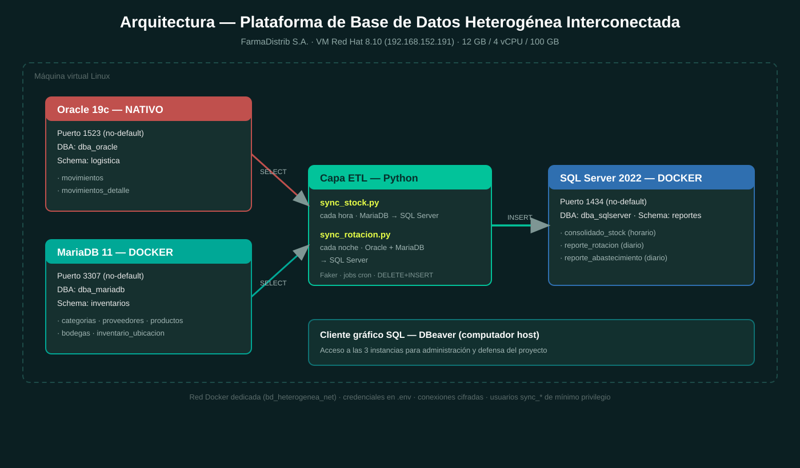

# Plataforma de Base de Datos Heterogénea Interconectada


**Proyecto Integrador · ITIZ3201 — Administración de Base de Datos · RC5**
Caso de estudio: **FarmaDistrib S.A.** (distribución farmacéutica)

Plataforma que interconecta tres SGBD heterogéneos —**Oracle 19c**, **MariaDB 11**
y **SQL Server 2022**— mediante una capa ETL en Python con jobs programados,
para eliminar el cruce manual de datos entre Bodega, Logística y Gerencia.



---

## 1. Objetivos del trabajo

- Desplegar una plataforma heterogénea con los tres motores sobre una única VM Linux.
- Implementar las bases de datos de cada dominio en su propio esquema.
- Construir una capa de interconexión automática (ETL) que consolide la información.
- Validar el desempeño con pruebas de carga, integridad y tiempos de respuesta.

## 2. Roles del equipo

| Integrante | Rol | Responsabilidad principal |
|------------|-----|----------------------------|
| Guillermo Ruales | Líder | Oracle 19c + capa de interconexión |
| Israel Tabango | Desarrollo | MariaDB 11 + generación Faker MariaDB |
| Anthony Montalvo | Desarrollo | SQL Server 2022 + sincronización de stock |
| Luis Cando | Infra / Docs | Docker + documentación |

## 3. Arquitectura

| Motor | Puerto (no-default) | Despliegue | DBA | Esquema | Rol |
|-------|:-------------------:|------------|-----|---------|-----|
| Oracle 19c | 1523 | Nativo | `dba_oracle` | `logistica` | Movimientos logísticos |
| MariaDB 11 | 3307 | Docker | `dba_mariadb` | `inventarios` | Maestros e inventario |
| SQL Server 2022 | 1434 | Docker | `dba_sqlserver` | `reportes` | Reportes consolidados |

**Decisión de diseño:** Oracle se mantiene nativo (ya desplegado y configurado);
MariaDB y SQL Server van en Docker por sus imágenes oficiales certificadas,
aislamiento y control de versiones. Los puertos se alejan de los defaults
(1521 / 3306 / 1433) por seguridad.

## 4. Estructura del repositorio

```
proyecto-bd-heterogenea-itiz3201/
├── oracle/      Limpieza, setup, DDL y configuración de red (listener/tns)
├── mariadb/     Setup de usuarios y DDL de maestros e inventario
├── sqlserver/   Setup, DDL de reportes y permisos del ETL
├── docker/      Scripts de despliegue y docker-compose
├── python/      Generadores Faker, ETL (sync) y prueba de carga
├── scripts/     Instalación de Docker y crontab de los jobs
└── docs/        Diagrama de arquitectura e informe de cumplimiento
```

## 5. Puesta en marcha

### 5.1 Requisitos

- VM Red Hat 8.10 con Oracle 19c instalado (nativo).
- Acceso `sudo`. Python 3.9+ y, para SQL Server, el *ODBC Driver 18*.

### 5.2 Orden de ejecución

```bash
# 1) Docker
cd scripts && ./01_install_docker.sh        # reiniciar sesión al terminar

# 2) Oracle (como usuario oracle)
sqlplus / as sysdba @oracle/00_limpieza.sql
sqlplus / as sysdba @oracle/01_setup_oracle.sql
cp oracle/listener.ora oracle/tnsnames.ora $ORACLE_HOME/network/admin/
lsnrctl reload
sqlplus logistica/"Logist1ca#2026"@ORCLPDB @oracle/02_ddl_tablas.sql

# 3) MariaDB y SQL Server (Docker)
cd docker
export MARIADB_ROOT_PWD='RootMaria#2026' MSSQL_SA_PWD='SaMssql#2026'
./deploy_mariadb.sh
./deploy_sqlserver.sh
#   (alternativa: docker compose up -d  +  aplicar los .sql manualmente)

# 4) Entorno Python
cd ../python
python -m venv .venv && source .venv/bin/activate
pip install -r requirements.txt
cp .env.example .env        # editar credenciales/host reales

# 5) Carga inicial de datos (Faker)
python generar_mariadb.py
python generar_oracle.py

# 6) Primera sincronización manual
python sync_stock.py
python sync_rotacion.py

# 7) Programar los jobs
crontab ../scripts/crontab.txt && crontab -l
```

## 6. Capa de interconexión

| Job | Frecuencia | Origen → Destino | Tabla destino |
|-----|-----------|------------------|---------------|
| `sync_stock.py` | Cada hora (`0 * * * *`) | MariaDB → SQL Server | `consolidado_stock` |
| `sync_rotacion.py` | Cada noche (`0 0 * * *`) | Oracle + MariaDB → SQL Server | `reporte_rotacion`, `reporte_abastecimiento` |

Patrón **DELETE + INSERT** transaccional (idempotente). La justificación técnica
completa está en [`docs/informe_cumplimiento.md`](docs/informe_cumplimiento.md).

## 7. Validación de desempeño

```bash
cd python && source .venv/bin/activate
python prueba_carga_5000.py
```

Inserta 5.000 registros en MariaDB, mide el tiempo de carga y de sincronización,
y valida la integridad comparando conteos y stock agregado entre origen y destino.

## 8. Seguridad

- Credenciales en `.env` (no versionado); plantilla en `.env.example`.
- Un DBA dedicado por motor y usuarios `sync_*` de mínimo privilegio para el ETL.
- Conexiones cifradas: `REQUIRE SSL` en MariaDB, `Encrypt=yes` en SQL Server.
- Red Docker dedicada y puertos no-default.

## 9. Cliente gráfico

**DBeaver** instalado en el host, con conexiones a las tres instancias por sus
puertos no-default; se utiliza en la defensa del proyecto.
